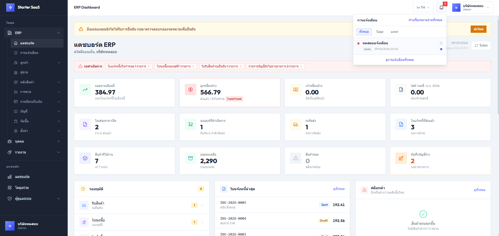

# Starter SaaS

A multi-tenant ERP/SaaS starter built as an npm-workspaces monorepo: an Express + Sequelize REST API and a Vue 3 single-page app, sharing a modular (HMVC) ERP layer. It ships with a guided install wizard, JWT auth, per-organization data isolation, realtime in-app alerts, a full set of ERP modules (sales, purchasing, inventory, accounting, HRMS), and an AI assistant that connects to a local LLM.



## Tech stack

- **Backend:** Node.js, Express, Sequelize ORM, JWT (access + refresh), bcrypt, express-validator, Socket.IO (realtime), Winston logging
- **Database:** SQLite by default; also supports PostgreSQL, MySQL, MariaDB, and SQL Server (selectable at install time)
- **Cache:** optional Redis (ioredis) with a transparent in-memory fallback
- **Frontend:** Vue 3, Vite, Pinia, Vue Router, Vue I18n, Tailwind CSS, Axios
- **i18n:** English and Thai, split per module and auto-merged; supports CE/BE calendars and configurable currency formatting
- **AI assistant:** local LLM via Ollama or LM Studio; tool-calling agent that navigates pages, manages records (create/update/delete), and reports live KPIs — grounded in your data and replying in your selected language

## Repository layout

```
starter-saas/
├── server/        Express API — bootstrap, core (auth, modules, migrator, tenant), server-only modules
│   ├── modules/   auth, organizations, permissions, roles, profile, system, dashboard
│   ├── core/      module loader, migrator, multi-tenant scoping helpers, logger
│   └── config/    database + app config (env-driven)
├── client/        Vue 3 SPA (Vite)
│   └── src/modules/   auth (incl. install wizard), dashboard, profile, admin
├── shared/        HMVC business modules consumed by the server
│   ├── erp/       products, pricing, customers, vendors, quotations, orders, invoices,
│   │              receipts, purchasing, inventory/stock, accounting, alerts, settings, …
│   ├── hrms/      departments, employees
│   └── ai-agent/  local-LLM chat, tool registry, provider adapters (Ollama / LM Studio)
├── scripts/       schema + diagram generators (introspect models/routes → docs/*.html)
├── docs/          generated reference: schema.html, ER-schema.html, swimlane-process.html, data-flow.html
└── package.json   workspace root
```

## ERP module structure

Each ERP feature under `shared/erp/` is a self-contained HMVC module that bundles its
backend (controllers/services/models/routes/migrations) and frontend (Vue views + i18n)
together. Using `products` as a concrete example:

```
shared/erp/products/
├── controllers/        Thin HTTP handlers — read req, call service, shape response
│   ├── product.controller.js
│   └── product-category.controller.js
├── services/           Business logic: transactions, validation, org-scoped queries
│   ├── product.service.js
│   └── product-category.service.js
├── routes/             Express routers; each exports { mountPath, router }
│   ├── product.routes.js            → mountPath: '/item-master'
│   └── product-category.routes.js   → mountPath: '/product-categories'
├── models/             Sequelize models + association wiring
│   ├── product.model.js
│   ├── product-category.model.js
│   └── product.association.js
├── migrations/         Schema migrations (run automatically on boot)
├── seeds/              Optional seed data
├── validators/         express-validator rule sets
├── ai-tools/           AI agent tool definitions scoped to this module (optional)
│   └── index.js        Exports { tools, navTargets } — auto-discovered by the tool registry
├── views/              Vue 3 SPA pages (lists + dedicated create/edit pages)
│   ├── products/        ProductsList.vue, ProductCreate.vue, ProductEdit.vue
│   └── categories/      ProductCategoriesList.vue, …Create.vue, …Edit.vue
├── i18n/               Per-module locale messages
│   ├── en.js
│   └── th.js
├── __tests__/          Jest unit tests for services
└── index.js            Client entry: exports `routes` + `navChildren` for the SPA
```

How the pieces get wired up automatically:

- **Backend routes** — `shared/erp/erp.module.js` recursively discovers every `*.routes.js`
  file and mounts its router under the `/api/erp` prefix (so `product.routes.js` with
  `mountPath: '/item-master'` is served at `/api/erp/item-master`). Routes are protected by
  the `authenticate` middleware and per-action permissions.
- **Frontend routes & nav** — `shared/erp/index.js` eager-loads each submodule's `index.js`
  via `import.meta.glob`, flat-merges their `routes`, and assembles the ERP navigation tree
  from their `navChildren`.
- **Multi-tenancy** — services scope every read/update/delete to the caller's organization
  using the helpers in `server/core/tenant.js`, so one org can never reach another's records.

To add a new ERP module, create a folder under `shared/erp/<feature>/` following the same
layout — no central registry edits are needed; the route/nav auto-discovery picks it up.

## Realtime alerts

The `shared/erp/alert` module powers the notification bell in the topbar.
Alerts can be authored for everyone (`global`), a specific module, or an HRMS department,
and are delivered live over **Socket.IO** — the server wraps Express in an HTTP server
(and an HTTPS server too when [HTTPS](#https) is enabled),
authenticates each socket with the JWT access token, and joins per-org / per-module /
per-department rooms so a change reaches only the eligible recipients. The bell shows an
unread badge and a panel with All / Module / Department filters; read state is tracked
per user. Other modules can raise alerts programmatically via the service's
`emitSystem()` helper. Guarded by the `erp.alerts.list` / `erp.alerts.manage` permissions.

## AI assistant

The `shared/ai-agent` module provides a conversational AI assistant that connects to a
locally-hosted LLM (no cloud key required).

**Provider support**

| Provider | Default base URL |
|---|---|
| [Ollama](https://ollama.com) | `http://localhost:11434` |
| [LM Studio](https://lmstudio.ai) | `http://localhost:1234/v1` |

The provider, model, temperature, system prompt, an optional API key, and the **auto-action**
toggle are configurable per organization from **AI → Settings** (`/ai/settings`).

**Tool-calling agent**

The assistant uses the LLM's native tool-calling interface. `shared/ai-agent/services/tools.js`
only owns the core `navigate` tool — all other tools and nav targets are auto-discovered at
startup by scanning every `shared/erp/<module>/ai-tools/index.js` file.

Each `ai-tools/index.js` exports `{ tools, navTargets }`:

```js
// shared/erp/<feature>/ai-tools/index.js
const navTargets = {
  feature_list:   { path: '/erp/feature',        label: 'Feature' },
  feature_create: { path: '/erp/feature/create', label: 'New Feature' },
}

const tools = [
  {
    name: 'create_feature',
    kind: 'server',            // 'server' = runs handler; 'client' = sends action to browser
    description: '...',
    parameters: { type: 'object', properties: { name: { type: 'string' } }, required: ['name'] },
    async handler(args, { user }) {
      const svc = require('../services/feature.service')
      const created = await svc.create({ ...args, organizationId: user.organizationId })
      return {
        result: { id: created.id, name: created.name },        // summarized back to the model
        action: { type: 'navigate', path: `/erp/feature/${created.id}/edit`, label: created.name },
      }
    },
  },
]

module.exports = { tools, navTargets }
```

A handler returns `{ result, action? }`: `result` is fed back to the model, and the optional
`action` is forwarded to the browser (e.g. SPA navigation). Read-only **reporting** tools omit
`action` and return data only, so the model narrates an answer instead of opening a page.

Modules with several controllers can split their tools one file per controller (e.g.
`product.ai-tools.js` + `product-category.ai-tools.js`) and merge them in `index.js` — the
registry only loads `index.js`. Modules with nav targets but no tools yet still export
`{ tools: [], navTargets }` so the `navigate` tool knows about their pages. Current coverage:

| Module | Nav targets | Tools |
|---|---|---|
| `dashboard` | `dashboard` | `executive_summary`, `financial_summary`, `inventory_summary` (read-only KPI reporting) |
| `products` | `products_list`, `product_create`, `product_categories_list`, `product_category_create` | `create`/`list`/`get`/`update`/`delete_product`, `create`/`list_product_categories` |
| `customers` | `customers_list`, `customer_create`, `customer_groups_list`, `customer_group_create` | `create`/`list`/`get`/`update`/`delete_customer`, `create`/`list_customer_groups` |
| `orders` | `orders_list`, `order_create` | — |
| `invoices` | `invoices_list`, `invoice_create` | — |
| `settings` | `settings` | — |

Mutating/lookup tools resolve records by name (the model never sees UUIDs): a free-text term
is matched to exactly one record, and ambiguous or empty matches return a clarifying message
instead of acting.

**Adding tools for a new ERP module**

Create `shared/erp/<feature>/ai-tools/index.js` and export `{ tools, navTargets }`.
No edits to `tools.js` are needed — the file is picked up automatically on next boot.

**Behavior**

- **Grounded answers** — an always-on data-integrity guardrail in the system prompt requires
  every figure to come from a tool result; the model won't invent or estimate numbers, and
  reports zero / no-data honestly. All tools are organization-scoped to the caller's data.
- **Auto-action** — when enabled (default), actions the assistant returns (e.g. navigation)
  run automatically; when off they render as clickable chips the user triggers. The reply
  also follows the app's selected language (English / ไทย).

**UI**

- **Full-page chat** — `/ai/chat` — conversation sidebar + message thread, with clickable
  sample prompts on the empty state and light markdown rendering for clean, structured replies.
- **Slide-over panel** — a sparkles button (✦) in the topbar, or the **Shift+A** shortcut,
  opens a compact chat panel from anywhere in the app.

Conversations and messages are stored per organization in the database. The assistant is
disabled by default until a provider is configured and tested.

## Prerequisites

- Node.js 18+ and npm 9+
- (Optional) PostgreSQL / MySQL / MariaDB / SQL Server if you don't want SQLite
- (Optional) Redis if you want a shared cache
- (Optional) Ollama or LM Studio running locally for the AI assistant

## Getting started

```bash
# 1. Install dependencies for the root, server, and client workspaces
npm run install:all

# 2. Start the API and the SPA together (API on :3000, SPA on :5173)
npm run dev
```

Then open the SPA and complete the **install wizard** at `/install`. The wizard lets you:

- choose the default workspace language (English / ภาษาไทย),
- pick and test the database connection (SQLite path, or a relational DB),
- optionally enable and test Redis,
- create the first admin account,
- optionally seed default reference sequences and a full set of **demo data** (seeded in the language you selected).

After install you'll be signed in and redirected to the dashboard.

> The API runs migrations and base seeds automatically on boot, so a fresh database is provisioned the first time the server starts.

## Configuration

The server reads configuration from environment variables (a `server/.env` file is loaded via dotenv). Common variables:

| Variable | Default | Purpose |
|---|---|---|
| `PORT` | `3000` | HTTP API port |
| `NODE_ENV` | `development` | `production` requires the JWT secrets below |
| `HTTPS_ENABLED` | `false` | Also serve HTTPS alongside HTTP (see [HTTPS](#https)) |
| `HTTPS_PORT` | `3443` | HTTPS port when `HTTPS_ENABLED=true` |
| `HTTPS_KEY_PATH` / `HTTPS_CERT_PATH` | — | Paths to the TLS private key / certificate (PEM) |
| `HTTPS_REDIRECT` | `false` | Redirect plain HTTP requests to the HTTPS port |
| `COOKIE_SECURE` | `auto` | Refresh-cookie `Secure` flag — `auto` mirrors the request scheme; `true`/`false` force it |
| `TRUST_PROXY` | `false` | Trust `X-Forwarded-Proto`/`-For` behind a reverse proxy (`true`, a hop count, or a subnet) |
| `DB_DIALECT` | `sqlite` | `sqlite` \| `postgres` \| `mysql` \| `mariadb` \| `mssql` |
| `DB_STORAGE` | `./data/database.sqlite` | SQLite file path (relative paths anchor to the repo root) |
| `DB_HOST` / `DB_PORT` / `DB_NAME` / `DB_USER` / `DB_PASSWORD` | — | Relational DB connection |
| `JWT_SECRET` / `JWT_REFRESH_SECRET` | random in dev | Token signing secrets (required in production) |
| `REDIS_ENABLED` | `false` | Enable Redis cache (`REDIS_HOST`, `REDIS_PORT`, `REDIS_PASSWORD`, `REDIS_DB`) |
| `CLIENT_URL` | `http://localhost:5173` | Allowed CORS origin |
| `SMTP_*` | — | Outgoing mail for email verification / password reset |

Most of these can also be set through the install wizard, which writes them and restarts the API when needed.

### HTTPS

The server speaks **HTTP and HTTPS at the same time**. HTTP on `PORT` is always on; set
`HTTPS_ENABLED=true` with a key/cert pair to additionally listen on `HTTPS_PORT`. Socket.IO
is attached to both servers, so realtime works over either scheme.

```bash
# Generate a self-signed certificate for local development (needs openssl)
mkdir certs
openssl req -x509 -newkey rsa:2048 -nodes -keyout certs/key.pem \
  -out certs/cert.pem -days 365 -subj "/CN=localhost"
```

```ini
# server/.env
HTTPS_ENABLED=true
HTTPS_PORT=3443
HTTPS_KEY_PATH=./certs/key.pem
HTTPS_CERT_PATH=./certs/cert.pem
# HTTPS_REDIRECT=true   # optional: bounce http → https
```

The refresh-token cookie's `Secure` flag follows the request scheme by default
(`COOKIE_SECURE=auto`), so the same login/refresh flow works over both `http://` and
`https://` without changes. When TLS is terminated by a reverse proxy, set `TRUST_PROXY=true`
so the original scheme is detected (and typically `COOKIE_SECURE=true` in production).

To point the Vite dev server's proxy at the HTTPS API, set
`VITE_API_TARGET=https://localhost:3443` for the client — self-signed certs are accepted.

## Scripts

**Root**

| Command | Description |
|---|---|
| `npm run dev` | Run API and SPA concurrently |
| `npm run dev:server` / `npm run dev:client` | Run one side only |
| `npm run build` | Build the SPA for production |
| `npm run install:all` | Install dependencies across all workspaces |

**Server** (run inside `server/`)

| Command | Description |
|---|---|
| `npm run dev` | API with nodemon |
| `npm start` | API with node |
| `npm run migrate` / `migrate:status` / `migrate:down` | Database migrations |
| `npm run seed` / `seed:core` | Run seeders |
| `npm test` | Unit tests (Jest) |

## Testing

Unit tests use Jest and live next to the code they cover (`**/__tests__/*.test.js`). Run them from the `server/` directory so the project Jest config (`server/jest.config.js`) is picked up:

```bash
cd server
npm test                 # all suites
npx jest shared/erp/...  # a subset
```

## Security

Baseline hardening is built in: security response headers
(`X-Content-Type-Options`, `X-Frame-Options`, `Referrer-Policy`, HSTS in
production, …), stateless JWT auth (short-lived access token + an `httpOnly`,
`SameSite=Strict` refresh cookie), per-organization data isolation, rate
limiting on the auth endpoints, and tight request-body size limits. See
[HTTPS](#https) for TLS and proxy-aware secure cookies.

### Static analysis (Semgrep)

The codebase is scanned with [Semgrep](https://semgrep.dev) using the registry
`p/default` ruleset:

```bash
semgrep scan --config p/default          # human-readable
semgrep scan --config p/default --json   # machine-readable (semgrep-report.json)
```

The scan is **clean — zero findings**. The handful of audit-rule matches that
are false positives for this architecture are *not* suppressed globally;
instead each carries an inline `// nosemgrep: <rule-id>` comment stating why the
finding is safe, so the reasoning is reviewable next to the code:

- **path-traversal** in the module / seed / migration loaders — they join a
  fixed `__dirname` base with `fs.readdirSync` entries, never request input.
- **using-http-server** — the plain-HTTP listener is intentional for the
  HTTP/HTTPS dual-serving described under [HTTPS](#https).
- **csurf middleware** — the API is stateless Bearer-token auth whose only
  cookie (the refresh token) is `httpOnly` + `SameSite=Strict`, so CSRF is
  already mitigated without a token middleware.

When a real issue is found, fix it in code (e.g. verify JWTs rather than decode
them, avoid `v-html` sinks); reserve `nosemgrep` for reviewed, justified
exceptions only.

## Internationalization

Locale messages are split per module (e.g. `client/src/modules/*/i18n/{en,th}.js` and `shared/erp/*/i18n/{en,th}.js`) and merged automatically at build time. The active language is stored client-side and chosen during install; demo data is seeded in the selected language.

## Documentation & diagrams

The `scripts/` folder holds standalone generators that introspect the live Sequelize
model registry and the Express route files — no database connection or running server
required — and emit self-contained, interactive HTML into `docs/`. Run any of them from
the repo root and re-run after schema or route changes to refresh the output:

| Command | Output | What it shows |
|---|---|---|
| `node scripts/export-schema.js` | `docs/schema.html` | Tabular schema — every table's columns, flags (PK/FK/unique/…), and relations; grouped and filterable by module |
| `node scripts/export-er-diagram.js` | `docs/ER-schema.html` | Entity-relationship diagram (Mermaid `erDiagram`); toggle modules to re-render a filtered view |
| `node scripts/export-swimlane-process.js` | `docs/swimlane-process.html` | BPMN-style **business-process** swimlanes derived from the route files — Order-to-Cash and Procure-to-Pay document flows, with modules as lanes |
| `node scripts/export-data-flow.js` | `docs/data-flow.html` | Level-1 **data-flow diagram** — the Client as external entity, one Process + Data Store per module, and cross-module FK dependencies as data flows |

Each diagram supports per-module filter chips, layout/label toggles, and pan/zoom. The
diagrams load Mermaid and svg-pan-zoom from a CDN, so viewing them needs internet access;
`schema.html` is fully offline. The shared `scripts/_introspect.js` helper maps every model
to its module from the source path.

## License

MIT License
